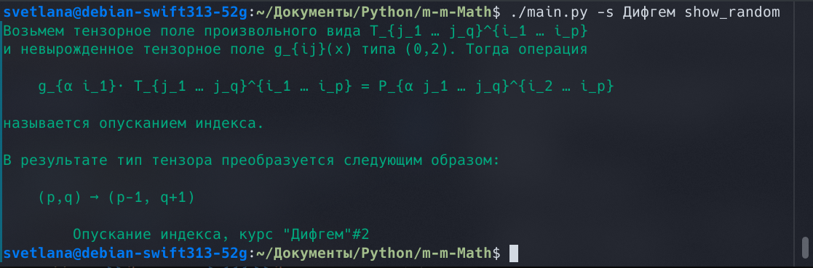

# Learn that things

This small repository will try to help with this challenge. Build your own *sqlite*-database of definitions.

Now you can also easily export (import) definitions to (from) the *LaTeX*-file.

For **Linux** (I do not know if the program works on **Windows**. But it is quite possible)

## **Usage**

### Command scheme

```bash
usage: main.py [-h] [-f FILE] [-s SUBJECT] [-d DATA]
               {add_def,show_random,from_file,latex,export,help}
```

Note: * means necessary

### Global args

There are three possible argument (except *command* and *help*):

* **-f** file path, relative or absolute

* **-s** subject name

* **-d** data-base path, default 'db_commands.sqlite'

### Commands

* **add_def**

Add single note to the base. Keyboard input. You will be asked to enter

```txt
<string>        *what - concept, what should be defined
<string>        *def_body - definition
<string>        *subject - what subject
<integer>       lecture - number of the lection
```

* **show_random**

Show random def from the base. It will try to convert *latex*-expressions to Unicode (*see Thanks*)

#### Example



Essential argument is

```txt
-s <string>        subject - subject of random def, 'all' by default
```

* **from_file**
  
Import definitions from *json-file*. Default file is:

```txt
-f <string>        file - file with definitions, 'example.json' by default
```

* **latex**

Import definitions from *latex-file*. You need to specify the subject separately. Definitions **must** be of a fixed design, see example_latex.tex

```txt
-s <string>        subject - subject of defs, 'Жизнь' by default
-f <string>        file - file with definitions, 'example_latex.tex' by default
```

* **export**

Export definitions to latex, result in './exported'

```txt
-s <string>        subject - subject of defs, 'all' by default
-f <string>        file - file with definitions, 'exported.tex' by default
                                Will add extension '.tex' if necessary
```

## **Thanks**

Thanks [phfaist](https://github.com/phfaist/pylatexenc) for awesome python lib `pylatexenc`!

## TODO

* Tests =(

* Subjects for latex import

* Unknown macros for text output

* Changing and deleting existing records (now you can do this, for example, through the *sqlitebrowser*)

* Searching by name and tags

* References
